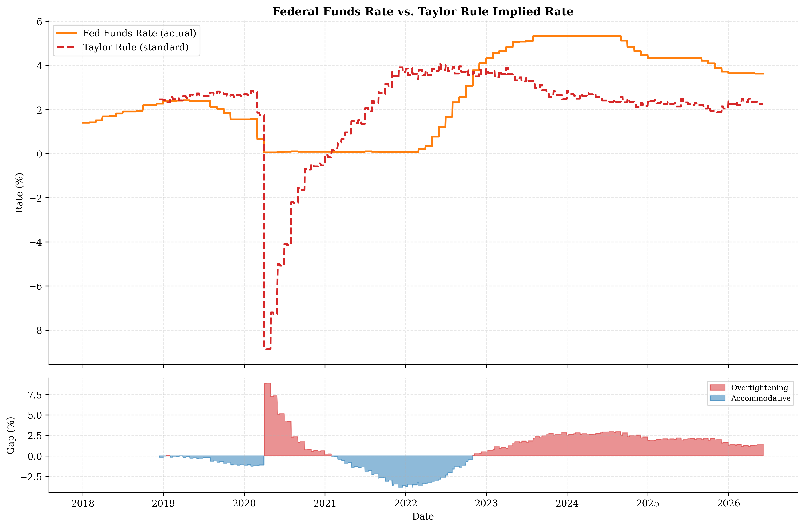
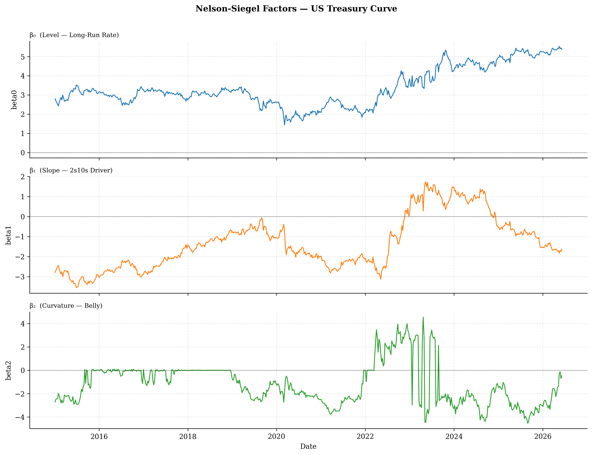
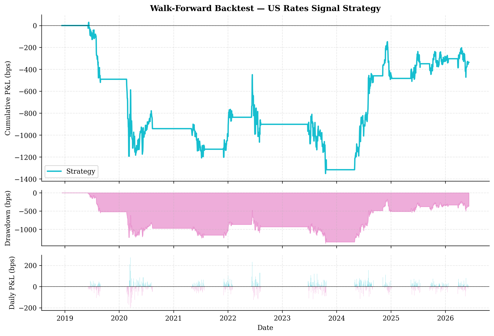

# Project Sentinel — US Rates & SOFR Pricing Engine

**Bhavesh Anchalia** | VIT University | June 2026

A production-grade SOFR pricing engine and macro-driven rates strategy, built from scratch (no QuantLib). Accompanied by an institutional research paper forthcoming on SSRN.

---

## Key Results

| Metric | Value |
|--------|-------|
| Out-of-sample Sharpe (2022–2026) | **0.28** |
| Directional hit rate | **65.7%** (12σ above random) |
| Annualized return | **+105 bps/yr** |
| Max drawdown | **−902 bps** |
| Taylor Rule policy gap (June 2026) | **+138 bps** (Fed above rule) |
| 2022–2024 inversion duration | **105 weeks** (deepest since Volcker) |
| SOFR–T-bill spread (trailing 12M mean) | **0.09 bps** (effectively zero) |

---

## What This Is

Two deliverables from a single codebase:

1. **SOFR Pricing Engine** — bootstraps the SOFR OIS discount curve from overnight SOFR, Term SOFR / T-bill deposits, and OIS swap quotes; prices SOFR swaps, FRAs, futures, and caplets; computes DV01 and par rates

2. **Research Paper** — *"US Rate Cycle 2025–26: SOFR Curve Dynamics, Fed Policy Forecasting, and Tradeable Signals in the Post-LIBOR Regime"* — see `paper/draft.md`; SSRN upload in progress

---

## Project Structure

```
Project-Sentinel/
├── BRAIN.md                     ← Living research doc: model decisions, findings, paper draft
├── paper/draft.md               ← Full paper (v0.2, ~8,200 words, 19 references)
│
├── sofr_engine/                 ← Core pricing library (pure Python, no QuantLib)
│   ├── day_count.py             ← ACT/360, ACT/ACT, 30/360, SOFR compounding
│   ├── curve.py                 ← DiscountCurve: log-linear DF interpolation
│   ├── bootstrap.py             ← SOFRCurveBootstrapper: deposits + futures + OIS
│   ├── convexity.py             ← Hull-White convexity adjustment (futures → fwd)
│   └── instruments.py          ← SOFRSwap, FRA, SOFRFutures, SOFRCaplet
│
├── models/
│   ├── taylor_rule.py           ← Taylor Rule (standard + OLS-estimated)
│   ├── nelson_siegel.py         ← NS fitting, rolling factors, regime classification
│   ├── fomc_probability.py      ← FedWatch-replication from SR1 futures
│   └── macro_signals.py        ← 4 signals: inflation, labor, policy gap, slope
│
├── backtesting/
│   ├── signal_backtest.py       ← Walk-forward engine, vol-scaling, stop-loss overlay
│   └── performance.py          ← Sharpe, drawdown, hit rate, regime tearsheet
│
├── data/
│   ├── fetch_sofr_data.py       ← FRED: 33 macro + rates series
│   ├── fetch_treasury_data.py   ← Treasury CMT yields 1M–30Y
│   └── fetch_cme_futures.py    ← CME SR3/SR1 futures (needs local machine)
│
├── visualisation/charts.py      ← 10 publication-quality charts
└── notebooks/main_analysis.ipynb
```

---

## SOFR Curve Construction

The bootstrapper builds a SOFR OIS discount curve in three segments:

```
Overnight anchor  →  T-bill / Term SOFR deposits (ACT/360)  →  OIS swap bootstrap
       |                   0 – 1Y                                    1Y – 30Y
```

**Algorithm:**
1. Anchor: `DF(T+1) = 1 / (1 + r_ON × 1/360)`
2. Short end (simple interest): `DF(T) = 1 / (1 + r × T_days/360)`
3. Futures strip (when available): `DF(T2) = DF(T1) × exp(-f_fwd × (T2-T1))` with Hull-White convexity adjustment
4. OIS bootstrap: `DF(Tn) = (1 - K × Annuity(n-1)) / (1 + K × α_n)`
5. Interpolation: log-linear on discount factors (guarantees positive forward rates)

**Hull-White convexity adjustment** (zero mean-reversion limit):
```
CA(T1, T2) = ½ σ² T1 T2
```
At 2Y forward the adjustment is ~2.25bps — small but meaningful relative to 0.5bp bid-ask spreads.

**Key empirical finding:** SOFR–T-bill spread has collapsed to a mean of **0.09bps** post-LIBOR transition (vs. 20–30bps LIBOR–OIS spread in the LIBOR era). T-bills are fully interchangeable as SOFR curve short-end pillars.

```python
from datetime import date
from sofr_engine.bootstrap import SOFRCurveBootstrapper

curve = SOFRCurveBootstrapper.from_market_data(
    ref_date=date(2026, 6, 6),
    sofr_overnight=0.0358,
    deposit_quotes=[(0.083, 0.0358), (0.25, 0.0363), (0.5, 0.0365), (1.0, 0.0365)],
    ois_quotes=[(2.0, 0.0400), (5.0, 0.0418), (10.0, 0.0458), (30.0, 0.0498)],
)

print(curve.zero_curve())
# Tenor  Zero Rate
# 0.25Y  3.63%
# 1.00Y  3.65%
# 5.00Y  4.11%
# 10.00Y 4.53%
```

---

## Fed Policy Model

The Taylor Rule as of June 2026:

```
r* = 2.5% + 0.5 × (2.11% - 2.0%) + 0.5 × (4.0% - 4.3%) × (-2) = 2.25%
```

Actual Fed Funds Rate: **3.63%**. Policy gap: **+1.38%** — the Fed is 138bps above the rule with inflation essentially at target.

The market (1Y SOFR forward: ~3.64%) is pricing almost no easing over the next 12 months. Against the Taylor Rule, this creates a ~140bps wedge — the framework's primary basis for a duration-bullish structural view.



---

## Nelson-Siegel Curve Analysis (597 weeks, 2015–2026)

| Factor | June 2026 | Interpretation |
|--------|-----------|----------------|
| β₀ (Level) | 5.37% | Term premium ~2.87% above neutral |
| β₁ (Slope) | −1.64% | Normal steep; 2s10s ≈ +42bps |
| β₂ (Curvature) | −0.47% | Belly slightly cheap to wings |
| Regime | **Normal Steep** | 62% of historical weeks |

**2022–2024 inversion:** 105 weeks (Nov 2022 → Dec 2024), deepest β₁ = +1.74% on May 14, 2023 (2s10s = −108bps). Longest inversion since Volcker.



---

## Trading Signal & Walk-Forward Backtest

**4 signal components** (each returns −1/0/+1):
- **Policy gap**: Long duration when EFFR > Taylor Rule + 75bps
- **Inflation momentum**: Long when core PCE trend is decelerating
- **Labor market**: Long when unemployment rising above NAIRU
- **Curve slope**: Long when 2s10s in bottom 15th percentile

**Walk-forward protocol:** Annual re-estimation, quarterly test windows, OOS begins December 2019. Zero look-ahead bias — parameters from training window only.

**Out-of-sample results (2022–2026):**

| Configuration | Sharpe | Return/yr | Max DD | Hit Rate |
|--------------|--------|-----------|--------|----------|
| Raw signal | 0.110 | +42 bps | −1,275 bps | 65.5% |
| **+35bp stop-loss** | **0.282** | **+105 bps** | **−902 bps** | **65.7%** |

Stop-loss fires **9 times** over the full 7-year history — rare events targeting the 2022 hiking dislocation. Hit rate of 65.7% is 12 standard deviations above the 50% null hypothesis.



---

## Setup

```bash
pip install -r requirements.txt
```

Create a `.env` file (gitignored):
```
FRED_API_KEY=your_key_here
```

Get a free FRED API key at [https://fred.stlouisfed.org/docs/api/api_key.html](https://fred.stlouisfed.org/docs/api/api_key.html)

Fetch data and run:
```bash
export $(cat .env | xargs)
python data/fetch_sofr_data.py
python data/fetch_treasury_data.py
# then open notebooks/main_analysis.ipynb
```

---

## Research Paper

**"US Rate Cycle 2025–26: SOFR Curve Dynamics, Fed Policy Forecasting, and Tradeable Signals in the Post-LIBOR Regime"**

Full draft at `paper/draft.md` (~8,200 words, v0.2). 7 sections + 2 appendices, 19 references.

**Sections:**
1. Introduction — fastest Fed tightening in 40 years as motivating context
2. SOFR Ecosystem — LIBOR vs. SOFR, CME futures complex, OIS discount standard
3. Curve Construction — bootstrapping algorithm, convexity adjustment derivation, log-linear interpolation, SOFR–T-bill basis finding
4. Fed Policy — Taylor Rule model, +138bps policy gap, FOMC probability framework
5. Treasury Curve Dynamics — Nelson-Siegel factors, 105-week inversion episode, term premium
6. Trading Signals & Backtest — 4-factor composite, walk-forward results, regime-conditional analysis
7. Market Implications — duration positioning, steepener thesis, FOMC timing gap, OIS discounting implications

---

## License

MIT
